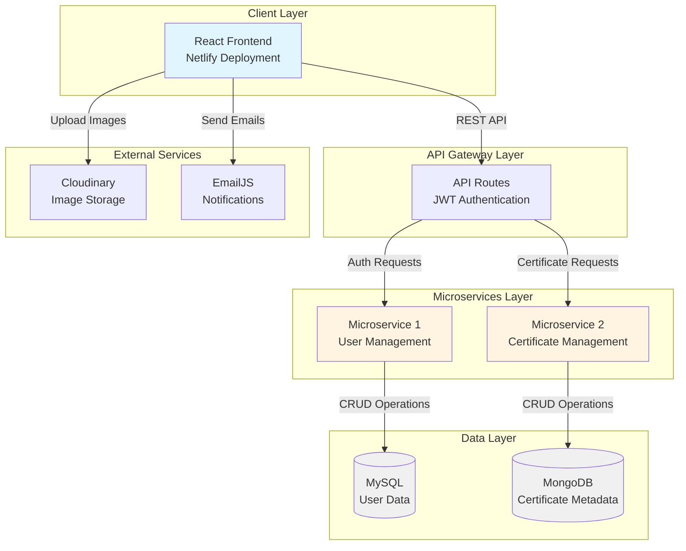
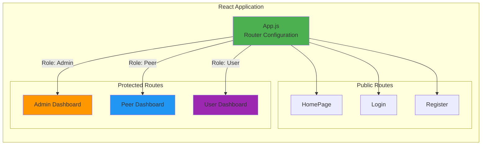
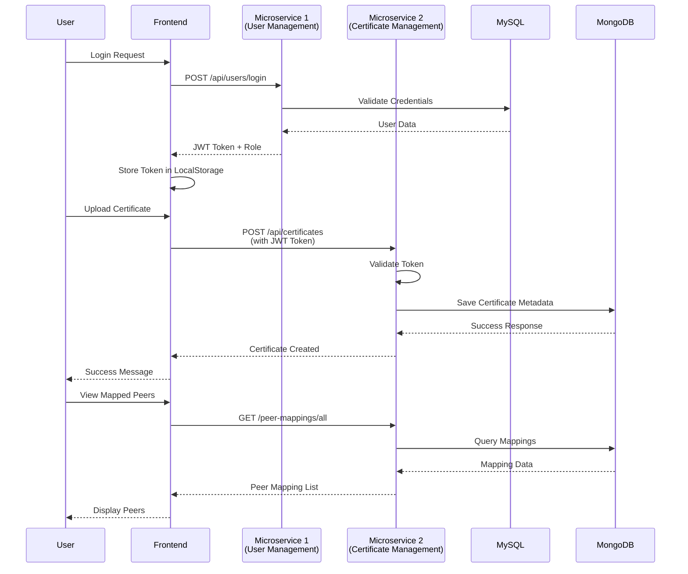
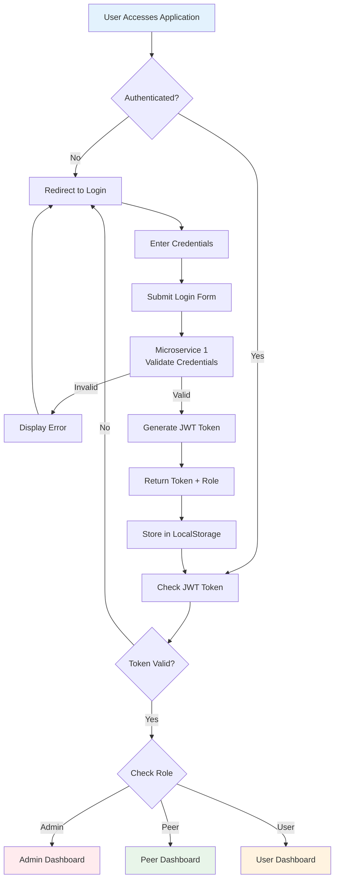
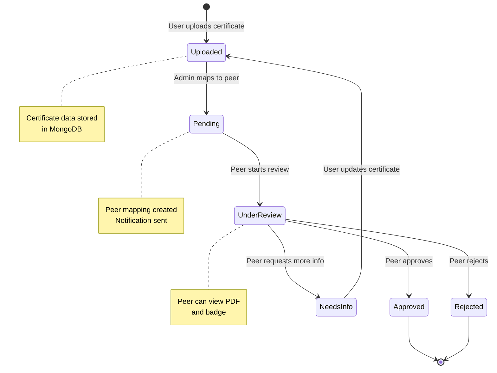
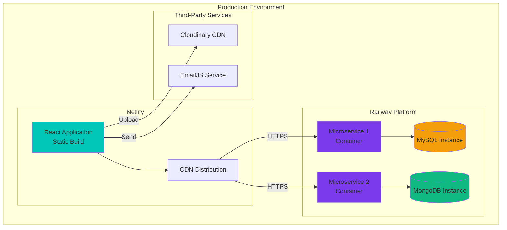

# SkillCert - Certificate Tracking Platform (Frontend)

<div align="center">
  
  **A Modern Certificate Management System**
  
  [](https://reactjs.org/)
  [](https://mui.com/)
  [](https://www.netlify.com/)
</div>

---

## Table of Contents
- [Overview](#overview)
- [System Architecture](#system-architecture)
- [Features](#features)
- [Technology Stack](#technology-stack)
- [Project Structure](#project-structure)
- [Getting Started](#getting-started)
- [User Roles and Permissions](#user-roles-and-permissions)
- [Backend Microservices](#backend-microservices)
- [Deployment](#deployment)
- [Future Enhancements](#future-enhancements)
- [Team](#team)

---

## Overview

**SkillCert** is a comprehensive certificate tracking and management platform developed as part of a Java Full Stack Development (JFSD) academic project. This repository contains the frontend application built with React, providing an intuitive interface for certificate management, peer verification, and administrative oversight.

The platform implements a microservices architecture with role-based access control (RBAC), enabling seamless certificate uploads, peer verification workflows, and comprehensive administrative management.

---

## System Architecture

### High-Level Architecture



### Component Architecture



### Data Flow Architecture



### Authentication Flow



### Certificate Verification Workflow



### Deployment Architecture



---

## Features

### User Features
- **Certificate Upload**: Submit professional certifications with comprehensive metadata
- **Peer Mapping**: View assigned peer reviewers for certificate verification
- **Dashboard Analytics**: Interactive charts and statistics visualization using Chart.js
- **Notification System**: Real-time updates on certificate verification status
- **Digital ID Card**: Generate personalized digital identification cards

### Peer Features
- **Certificate Verification**: Review and validate assigned certificates
- **Feedback Management**: Provide detailed comments for approval or rejection
- **Assignment Tracking**: Monitor all certificates mapped for review
- **Verification Dashboard**: Comprehensive statistics and activity monitoring

### Admin Features
- **User Management**: Complete CRUD operations for user accounts
- **Peer Administration**: Assign and manage peer reviewers
- **Certificate Mapping**: Distribute certificates to appropriate peers
- **System Analytics**: Platform-wide tracking and reporting
- **Notification Broadcasting**: Send announcements to users and peers
- **Comprehensive Dashboard**: System overview with detailed analytics

---

## Technology Stack

### Frontend Framework
- **React** (18.3.1) - Component-based UI framework
- **React Router DOM** (7.0.1) - Client-side routing and navigation
- **Material-UI** (6.1.8) - Enterprise-grade React component library
- **Emotion** (11.13.5) - CSS-in-JS styling solution
- **Styled Components** (6.1.13) - Component-level styling

### Data Visualization
- **Chart.js** (4.4.7) - Interactive chart library
- **React Chart.js 2** (5.2.0) - React wrapper for Chart.js

### HTTP and API
- **Axios** (1.7.7) - Promise-based HTTP client
- **CORS** (2.8.5) - Cross-Origin Resource Sharing middleware

### External Integrations
- **Cloudinary React** (1.8.1) - Image and file management
- **EmailJS** (3.2.0) - Email service integration

### Development Tools
- **React Scripts** (5.0.1) - Build and development scripts
- **Web Vitals** (2.1.4) - Performance monitoring

---

## Project Structure

```
SDPFRONT/
├── public/
│   ├── index.html
│   ├── manifest.json
│   └── robots.txt
│
├── src/
│   ├── components/
│   │   ├── Dashboards/
│   │   │   ├── Admin.js                    # Admin dashboard container
│   │   │   ├── Peer.js                     # Peer dashboard container
│   │   │   ├── User.js                     # User dashboard container
│   │   │   ├── MyId.js                     # Digital ID card component
│   │   │   ├── MyId.css                    # ID card styling
│   │   │   │
│   │   │   ├── AdminSide/
│   │   │   │   ├── AdminDashboard.js       # Admin analytics dashboard
│   │   │   │   ├── ManagePeer.js           # Peer management interface
│   │   │   │   ├── ManageUser.js           # User management interface
│   │   │   │   ├── MapToPeer.js            # Certificate-to-peer mapping
│   │   │   │   ├── TrackCerti.js           # Certificate tracking
│   │   │   │   ├── AdminNotification.js    # Notification management
│   │   │   │   ├── AboutDevs.js            # Developer information
│   │   │   │   └── PeerCard.css            # Peer card styling
│   │   │   │
│   │   │   ├── PeerSide/
│   │   │   │   ├── PeerDashboard.js        # Peer analytics dashboard
│   │   │   │   ├── MyMappedCerti.js        # Assigned certificates
│   │   │   │   └── PeerNotify.js           # Peer notifications
│   │   │   │
│   │   │   └── UserSide/
│   │   │       ├── UserDashboard.js        # User analytics dashboard
│   │   │       ├── UploadCertificate.js    # Certificate upload form
│   │   │       └── MappedPeers.js          # View assigned peers
│   │   │
│   │   ├── HomePage.js                      # Landing page component
│   │   ├── Login.js                         # Authentication component
│   │   └── Register.js                      # User registration form
│   │
│   ├── App.js                               # Root component with routing
│   ├── App.css                              # Global application styles
│   ├── index.js                             # Application entry point
│   ├── index.css                            # Root styling
│   └── .env                                 # Environment configuration
│
├── package.json                             # Project dependencies
├── package-lock.json                        # Dependency lock file
├── .gitignore                               # Git ignore rules
├── LOGS.TXT                                 # Development logs
└── README.md                                # Project documentation
```

---

## Getting Started

### Prerequisites
- Node.js (v14.0.0 or higher)
- npm (v6.0.0 or higher) or yarn (v1.22.0 or higher)
- Active backend microservices (see Backend Microservices section)
- Cloudinary account for image uploads
- EmailJS account for email notifications

### Installation

1. **Clone the repository**
```bash
git clone https://github.com/BejawadaRajkumar/Certificate-tracking-platform-frontend.git
cd Certificate-tracking-platform-frontend
```

2. **Install dependencies**
```bash
npm install
```

3. **Configure environment variables**

Create a `.env` file in the `src` directory:
```env
REACT_APP_MICROSERVICE1_URL=https://microservice1-production.up.railway.app
REACT_APP_MICROSERVICE2_URL=https://microservice2-production.up.railway.app
REACT_APP_CLOUDINARY_CLOUD_NAME=your_cloudinary_cloud_name
REACT_APP_CLOUDINARY_UPLOAD_PRESET=your_upload_preset
REACT_APP_EMAILJS_SERVICE_ID=your_emailjs_service_id
REACT_APP_EMAILJS_TEMPLATE_ID=your_emailjs_template_id
REACT_APP_EMAILJS_USER_ID=your_emailjs_user_id
```

4. **Start the development server**
```bash
npm start
```

The application will open at `http://localhost:3000`

5. **Build for production**
```bash
npm run build
```

This creates an optimized production build in the `build/` directory.

### Available Scripts

```bash
npm start          # Start development server
npm run build      # Create production build
npm test           # Run test suite
npm run eject      # Eject from Create React App (irreversible)
```

---

## User Roles and Permissions

### User Role
**Route**: `/user`

**Capabilities**:
- Upload certificates with metadata (name, issue date, expiry date, badge image, PDF file)
- View mapped peer reviewers assigned to their certificates
- Track certificate verification status (Pending, Under Review, Approved, Rejected)
- Access personal dashboard with certificate analytics
- Receive notifications about certificate status changes
- Generate and download digital ID card

**Restrictions**:
- Cannot access administrative functions
- Cannot verify other users' certificates
- Cannot manage system users or peers

### Peer Role
**Route**: `/peer`

**Capabilities**:
- View all certificates assigned for verification
- Approve or reject certificates with detailed comments
- Request additional information from certificate owners
- Access peer dashboard with verification statistics
- View certificate details including PDF and badge images
- Send notifications to certificate owners

**Restrictions**:
- Cannot access administrative functions
- Cannot upload personal certificates (focused on verification role)
- Cannot manage other peers or users

### Admin Role
**Route**: `/admin`

**Capabilities**:
- Full user management (Create, Read, Update, Delete)
- Full peer management and assignment
- Map certificates to appropriate peer reviewers
- Track all certificates across the entire platform
- Send system-wide notifications
- Access comprehensive analytics dashboard
- View all user, peer, and certificate data
- Generate system reports and statistics

**Restrictions**:
- None - Full system access

---

## Backend Microservices

### Microservice 1: User Management Service

**Repository**: [https://github.com/saimahendra282/Microservice1.git](https://github.com/saimahendra282/Microservice1.git)

**Technology Stack**:
- Spring Boot (Java)
- MySQL Database
- Spring Security
- JWT Authentication

**Responsibilities**:
- User authentication and authorization
- JWT token generation and validation
- User registration and profile management
- Role-based access control (User, Peer, Admin)
- Password encryption and security
- User CRUD operations

**API Endpoints**:
- `POST /api/users/login` - User authentication
- `POST /api/users/register` - New user registration
- `POST /api/users/get-profile` - Retrieve user profile
- `GET /api/users/adminusers` - Fetch all users (Admin only)
- `GET /api/users/peers` - Fetch all peers
- `GET /api/users/alladmins` - Fetch all administrators

### Microservice 2: Certificate Management Service

**Repository**: [https://github.com/saimahendra282/Microservice2.git](https://github.com/saimahendra282/Microservice2.git)

**Technology Stack**:
- Spring Boot (Java)
- MongoDB Database
- GridFS for file storage
- RESTful API design

**Responsibilities**:
- Certificate CRUD operations
- File metadata storage (badge images, PDF certificates)
- Certificate tracking URL management
- Peer-to-certificate mapping
- Certificate verification workflow
- Status tracking (Pending, Approved, Rejected)

**API Endpoints**:
- `POST /api/certificates` - Upload new certificate
- `GET /api/certificates/all` - Retrieve all certificates
- `GET /api/certificates/email` - Get user-specific certificates
- `GET /peer-mappings/all` - Retrieve all peer mappings
- `GET /peer-mappings/mapped/self` - Get self-assigned mappings
- `PUT /peer-mappings/update` - Update mapping status

### Database Schema

**MySQL (User Management)**:
```sql
Users Table:
- id (Primary Key)
- name
- email (Unique)
- phone
- password (Encrypted)
- role (User/Peer/Admin)
- dept (Department)
- profilePic (URL)
- created_at
- updated_at
```

**MongoDB (Certificate Management)**:
```javascript
Certificates Collection:
{
  _id: ObjectId,
  userId: String,
  email: String,
  name: String,
  issuedDate: Date,
  expiryDate: Date,
  trackId: String,
  trackUrl: String,
  badge: String (URL),
  pdfFile: String (URL),
  status: String (Pending/Approved/Rejected),
  createdAt: Date,
  updatedAt: Date
}

PeerMappings Collection:
{
  _id: ObjectId,
  certificateId: String,
  peerEmail: String,
  status: String,
  comment: String,
  assignedAt: Date,
  reviewedAt: Date
}
```

---

## Deployment

### Frontend Deployment (Netlify)

**Platform**: Netlify  
**Deployment Method**: Continuous Deployment from GitHub

**Configuration**:
```toml
[build]
  command = "npm run build"
  publish = "build/"

[build.environment]
  NODE_VERSION = "16"

[[redirects]]
  from = "/*"
  to = "/index.html"
  status = 200
```

**Deployment Steps**:
1. Connect GitHub repository to Netlify
2. Configure build settings
3. Set environment variables in Netlify dashboard
4. Enable automatic deployments on push to `main` branch

**Live URL**: [To be configured]

### Backend Deployment (Railway)

**Platform**: Railway  
**Deployment Method**: Docker containers (planned)

**Current Configuration**:
- Microservice 1 and 2 deployed as separate services
- MySQL and MongoDB instances managed by Railway
- Environment variables configured per service
- Free tier limitations apply

**Known Limitations**:
- Limited computational resources on free tier
- No Docker containerization implemented yet
- Database connections may timeout under heavy load
- File uploads limited by MongoDB free tier storage

---

## Future Enhancements

### Technical Improvements
- Implement Docker containerization for all services
- Migrate file storage from MongoDB to AWS S3
- Implement Redis for session management and caching
- Add WebSocket support for real-time notifications
- Implement comprehensive error logging with Sentry
- Add end-to-end testing with Cypress

### Feature Additions
- Certificate expiry reminder system
- Bulk certificate upload functionality
- Advanced search and filtering capabilities
- Certificate analytics and reporting dashboard
- Email notification system for all status changes
- Certificate renewal workflow
- QR code generation for certificate verification
- Mobile-responsive design improvements
- Dark mode support
- Multi-language support

---

## Team

**Development Team**:
- **Sai Mahendra** - Full Stack Developer & Project Lead
- **Raghu Ram Reddy** - Frontend Developer
- **Vishal Reddy** - Frontend Developer

---

<div align="center">
  <p>Developed as part of JFSD Academic Project</p>
  <p><strong>SkillCert</strong> - Empowering Professional Growth Through Verified Certifications</p>
</div>
